# 📊 Pipeline Híbrido para Análise da Alfabetização no Brasil

**Tech Challenge — Fase 2 | POSTECH (IA para Devs / 1IAST)**

Pipeline de dados híbrido (batch + streaming) em nuvem, seguindo a Arquitetura Medalhão, para integração e análise do **Indicador Criança Alfabetizada** — construído 100% dentro do nível gratuito do Google Cloud Platform.

---

## 1. Contexto do Problema

A alfabetização na infância é um dos pilares do desenvolvimento educacional, social e econômico de um país. O **Compromisso Nacional Criança Alfabetizada** é a política pública que mobiliza União, estados, DF e municípios com um objetivo claro: **todas as crianças brasileiras alfabetizadas até o final do 2º ano do ensino fundamental até 2030**.

Para dar régua e medida a essa política, o Inep realizou em 2023 a **Pesquisa Alfabetiza Brasil**, que definiu o ponto de corte de **743 pontos na escala de proficiência do Saeb**: a partir desse patamar, uma criança é considerada alfabetizada. Nasceu daí o **Indicador Criança Alfabetizada** — o percentual de estudantes que atingem esse nível.

O desafio é que acompanhar esse indicador exige **integrar fontes heterogêneas**: resultados por município e UF, metas pactuadas em três níveis federativos, dados territoriais do IBGE e microdados de milhões de alunos avaliados. Este projeto constrói a infraestrutura de dados que torna essa análise possível, confiável e barata — simulando o trabalho de um time de engenharia de dados de uma organização pública de análise educacional.

## 2. Arquitetura Proposta

### Diagrama da pipeline

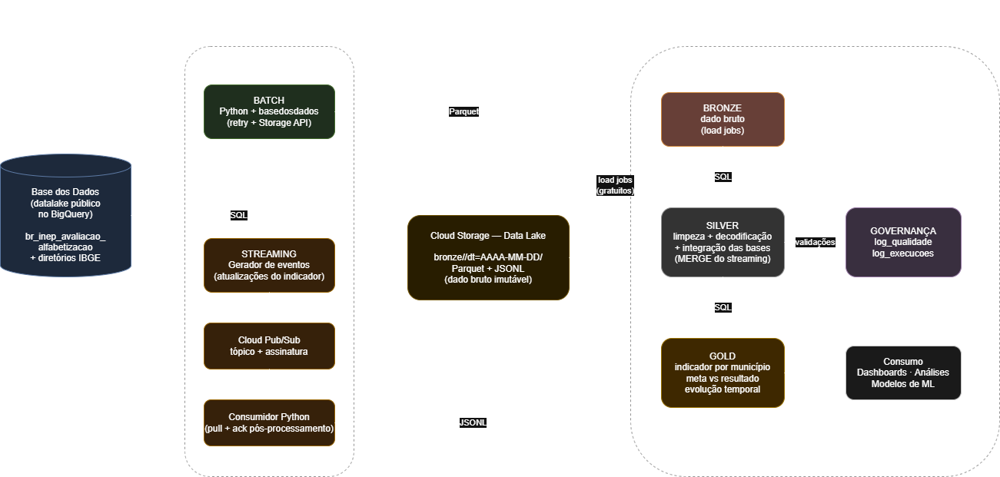

### Fluxo de dados

1. **Ingestão batch** — script Python consulta o datalake público da Base dos Dados (que vive no BigQuery) e extrai as 6 entidades exigidas: indicador por **Município** e **UF**, **metas de alfabetização Brasil / UF / Município**, microdados de **alunos**, mais o dicionário de códigos e os diretórios territoriais do IBGE. Salva tudo em **Parquet** na landing zone, com retry automático contra falhas de rede.
2. **Ingestão streaming** — um gerador publica eventos de atualização do indicador no **Pub/Sub** (tempo quase real); o consumidor puxa as mensagens, confirma o processamento (ack pós-processamento) e aterrissa os eventos brutos no lake e no BigQuery.
3. **Bronze** — dado bruto, sem transformação, particionado por data de ingestão (`dt=`) no Cloud Storage: histórico completo preservado. Carga no BigQuery via **load jobs (gratuitos)**.
4. **Silver** — limpeza (`SAFE_CAST`, remoção de registros sem chave), padronização de nomes e tipos, **decodificação via tabela `dicionario`** (série, rede, presença, alfabetizado), normalização de chaves (código IBGE de 7 dígitos, siglas de UF) e a **integração das bases**: indicador + território + metas na tabela `silver.indicador_integrado`. Os eventos de streaming são deduplicated e incorporados via **MERGE** — batch e streaming convergem aqui.
5. **Gold** — datasets analíticos prontos para BI e ML: indicador por município, **meta × resultado em três níveis federativos** (com gap em pontos e flag de atingimento), evolução temporal e resumo de proficiência dos microdados usando o corte oficial de 743 pontos.
6. **Governança transversal** — validações de qualidade e logs de execução gravados no dataset `governanca` a cada rodada.

## 3. Tecnologias Utilizadas

| Tecnologia | Papel | Justificativa |
|---|---|---|
| **BigQuery** | Camadas bronze/silver/gold + motor SQL | A Base dos Dados hospeda seu datalake no BigQuery — ingestão nativa, sem intermediários. Nível gratuito: 1 TiB de consultas + 10 GiB de armazenamento/mês |
| **Cloud Storage** | Data lake (dado bruto imutável) | Separa armazenamento de computação; Parquet particionado por data; 5 GB gratuitos |
| **Pub/Sub** | Mensageria do streaming | Serviço de eventos gerenciado, mesmo padrão conceitual do Kafka visto no curso; 10 GiB/mês gratuitos |
| **Python** (`basedosdados`, `google-cloud-*`) | Ingestão, orquestração e monitoramento | Ecossistema padrão de engenharia de dados; bibliotecas oficiais do GCP |
| **SQL (BigQuery)** | Transformações Silver/Gold e validações | Transformação declarativa, versionada no Git e executada onde o dado está (sem mover dados) |
| **Git/GitHub** | Versionamento com branches e PRs | Uma branch + PR por funcionalidade, histórico auditável da evolução do pipeline |

## 4. Decisões Arquiteturais (trade-offs)

**Batch vs Streaming** — dados históricos e metas mudam raramente: batch periódico é mais simples e barato. Já atualizações do indicador podem chegar a qualquer momento: o caminho streaming via Pub/Sub garante latência baixa. A arquitetura híbrida usa cada modo onde ele é melhor, e as duas trilhas convergem na Silver via MERGE.

**Data Lake vs Data Warehouse** — adotamos o padrão **lakehouse**: o Cloud Storage guarda o dado bruto imutável e barato (replay e auditoria), enquanto o BigQuery entrega SQL performático nas camadas tratadas. Não escolhemos um *ou* outro: cada um faz o que faz melhor.

**Custo vs Performance** — em um projeto governamental com dados de volume moderado, otimizamos para custo: load jobs gratuitos em vez de streaming inserts pagos; consumo do Pub/Sub em pull síncrono em vez de Dataflow (que não tem nível gratuito); orquestração via script versionado em vez de Cloud Composer (~US$ 300/mês). A performance permanece adequada: o pipeline completo roda em minutos.

**Kafka vs Pub/Sub** — o curso aprofundou Kafka (ETL — Aula 2); em produção auto-gerenciada ele seria o candidato natural. Optamos pelo Pub/Sub por ser serverless, gratuito nesta escala e sem administração de brokers — mesma semântica de tópicos/assinaturas, custo operacional zero.

## 5. Regras de Qualidade de Dados

Implementadas em `src/qualidade/validacoes.sql`, com resultado historizado em `governanca.log_qualidade`:

| Regra do edital | Implementação | Resultado |
|---|---|---|
| Duplicidade | Chaves `ano+id_municipio+serie+rede` (indicador) e `ano+id_aluno` (microdados) | ✅ OK |
| Valores ausentes | Linhas sem taxa/chave; municípios sem nome (join falho) | ✅ OK |
| Chaves de relacionamento | Anti-joins: indicador → dim_municipio; eventos → dim_municipio | ✅ OK |
| Consistência entre tabelas | Taxas e metas em [0,100]; ~5.570 municípios; média municipal × taxa oficial da UF | ✅ OK (5.571 municípios) |

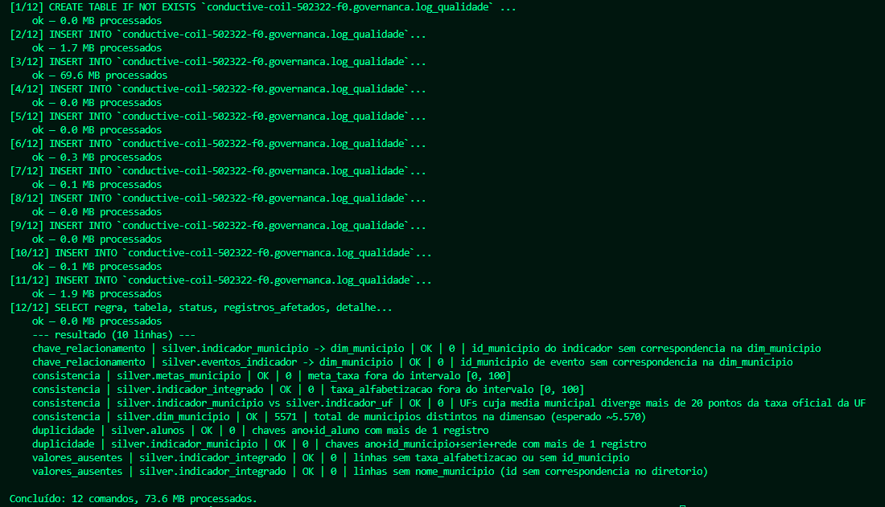

## 6. Monitoramento e Observabilidade

O orquestrador (`src/monitoramento/executar_pipeline.py`) executa as etapas na ordem correta e registra em `governanca.log_execucoes`:

- **Falhas de ingestão** — status por etapa; em falha, o pipeline é interrompido (dado inconsistente não propaga) e o processo sai com código de erro (alerta);
- **Latência** — duração em segundos de cada etapa, com painel de médias/máximas em `src/monitoramento/painel.sql`;
- **Volume** — resumo de linhas por tabela ao final de cada execução.

**Caso real durante o desenvolvimento**: uma queda de conexão a 98% do download dos microdados (execução `20260713_203609`) foi detectada, interrompeu o pipeline e ficou registrada no log. A correção — retry automático (3 tentativas) + BigQuery Storage API — está versionada no histórico do repositório. Em produção, o mesmo orquestrador rodaria agendado (Cloud Scheduler + Cloud Run) com alertas do Cloud Monitoring.

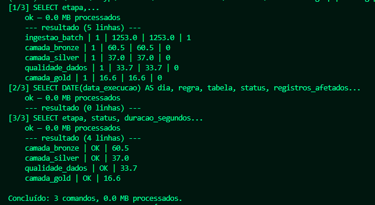

## 7. FinOps — Otimização de Custos

Decisões que mantêm o custo em **R$ 0,00**:

- **Parquet** (colunar + comprimido) em todo o lake; eventos em JSONL apenas na aterrissagem;
- **Particionamento** por data de ingestão no lake e **clustering** (`CLUSTER BY`) nas tabelas Silver/Gold mais consultadas;
- **Load jobs** (gratuitos) em vez de streaming inserts (pagos) — inclusive para os eventos do Pub/Sub;
- **Consultas otimizadas**: seleção explícita de colunas, filtros de partição; a execução completa das camadas Silver + qualidade + Gold processa **< 500 MB** de uma cota gratuita de 1 TiB/mês (< 0,05%);
- **Sem serviços de custo fixo**: nada de Dataflow, Dataproc ou Composer nesta escala.

**Estimativa de custo:**

| Cenário | Serviços | Custo mensal |
|---|---|---|
| **Este projeto (acadêmico)** | GCS (~0,5 GB) + BigQuery (~1 GB, ~2 GiB consultas) + Pub/Sub (KBs) | **R$ 0,00** (dentro do nível gratuito) |
| Produção (estimativa) | Mesma arquitetura + Cloud Scheduler/Run + Monitoring, atualização diária | ~US$ 5–15/mês |
| Produção com Composer/Dataflow (rejeitada) | Orquestração e streaming gerenciados | ~US$ 350+/mês |

## 8. Aplicação em IA

A camada Gold foi desenhada para alimentar modelos e análises:

- **Predição de alfabetização por município** — `gold.indicador_por_municipio` + `gold.proficiencia_municipio` como base de features; enriquecendo com Censo Escolar (infraestrutura), IBGE/PNAD (socioeconômico) e FUNDEB (financiamento), um modelo de regressão/gradient boosting pode prever o indicador do próximo ciclo e antecipar municípios em risco de não atingir a meta 2030;
- **Clusters de vulnerabilidade educacional** — agrupamento (k-means/HDBSCAN) de municípios por indicador, gap de meta, proficiência média e contexto territorial, revelando perfis que pedem políticas diferentes;
- **Políticas públicas baseadas em evidências** — `gold.meta_vs_resultado` responde diretamente "quais municípios estão mais distantes da meta?", priorizando apoio técnico e financeiro onde o gap é maior;
- **Análise de desigualdade** — a granularidade por rede (pública/privada) e região expõe assimetrias que médias nacionais escondem.

## 9. Estrutura do Repositório

```
tech-challenge-pipeline-gcp/
├── README.md
├── requirements.txt
├── docs/
│   ├── arquitetura.drawio       # fonte editável do diagrama
│   └── img/                     # diagrama e evidências de execução
├── data_samples/                # amostras (50 linhas) de cada tabela ingerida
└── src/
    ├── ingestao/batch_basedosdados.py    # batch: Base dos Dados -> landing (Parquet)
    ├── streaming/gerador_eventos.py      # publica eventos no Pub/Sub
    ├── streaming/consumidor_pubsub.py    # consome e aterrissa na bronze
    ├── bronze/carregar_bronze.py         # landing -> GCS -> BigQuery (load jobs)
    ├── silver/transformacoes.sql         # limpeza, decodificação e integração
    ├── gold/tabelas_analiticas.sql       # tabelas analíticas + amostras
    ├── qualidade/validacoes.sql          # 4 regras de qualidade -> governanca
    ├── monitoramento/executar_pipeline.py  # orquestrador com observabilidade
    ├── monitoramento/painel.sql          # painel de latência/falhas/volume
    └── executar_sql.py                   # executor genérico de SQL no BigQuery
```

## 10. Como Executar

**Pré-requisitos**: Python 3.12+, projeto no GCP (nível gratuito) com as APIs BigQuery, Cloud Storage e Pub/Sub habilitadas.

```bash
# 1. Clonar e preparar o ambiente
git clone https://github.com/felps2003/tech-challenge-pipeline-gcp.git
cd tech-challenge-pipeline-gcp
python -m venv .venv && source .venv/Scripts/activate   # Windows Git Bash
pip install -r requirements.txt

# 2. Configurar (o navegador abrirá para autorizar sua conta Google)
export GCP_PROJECT_ID=seu-project-id
export GCS_BUCKET=seu-bucket-unico

# 3. Pipeline completo com monitoramento (batch -> bronze -> silver -> qualidade -> gold)
python src/monitoramento/executar_pipeline.py

# 4. Streaming (em terminais separados, ou em sequência)
python src/streaming/gerador_eventos.py --n 200
python src/streaming/consumidor_pubsub.py

# 5. Painel de observabilidade
python src/executar_sql.py src/monitoramento/painel.sql
```

## 11. Resultados

**Data lake no Cloud Storage** (partição por data de ingestão):

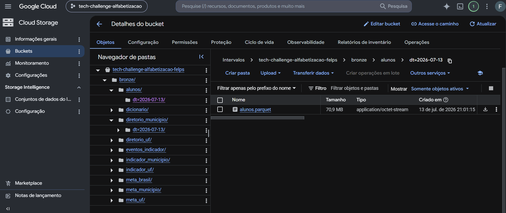

**Datasets no BigQuery** (arquitetura medalhão + governança):

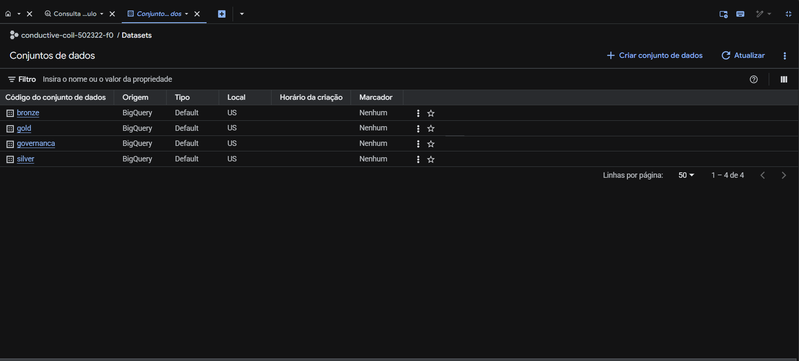

**Tabelas por camada:**

| Camada | Tabelas |
|---|---|
| 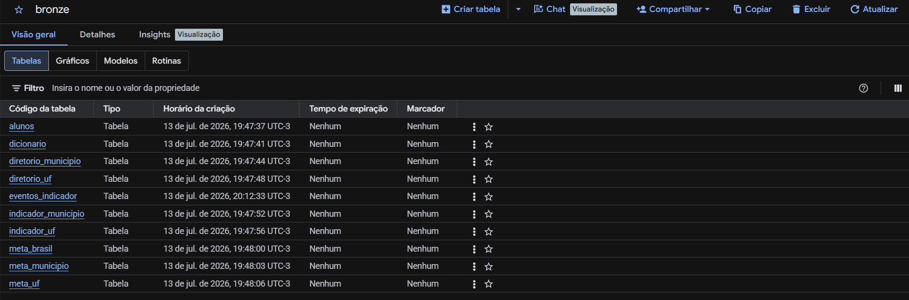 | 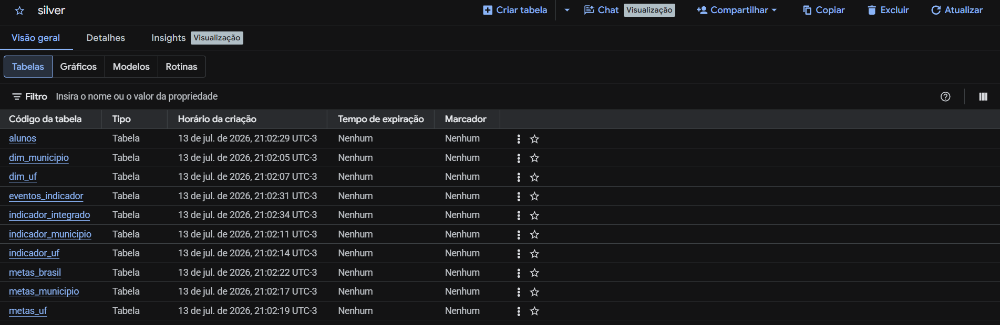 |
| 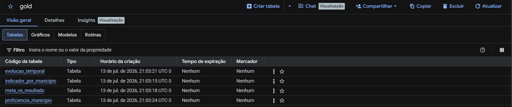 | 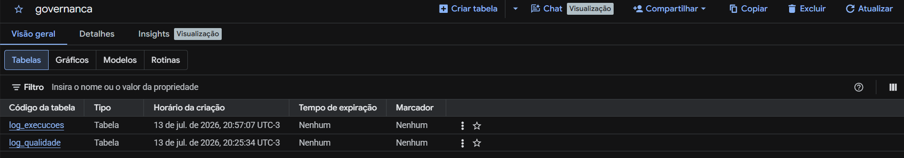 |

**Streaming no Pub/Sub** (tópico e assinatura):

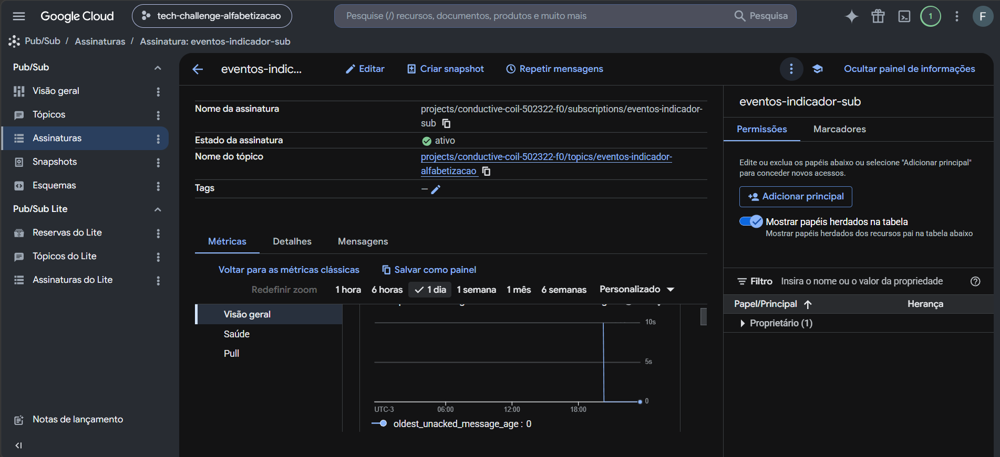

**Camada Gold em ação** — os 10 municípios mais distantes da meta:

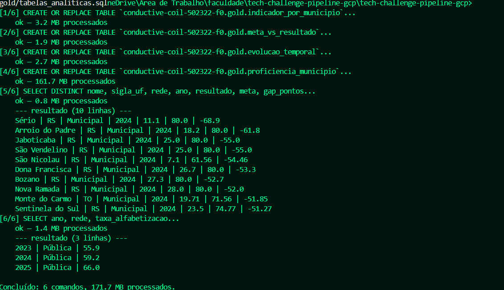

---

**Vídeo executivo**: [insira aqui o link do vídeo]

**Fontes**: [Indicador Criança Alfabetizada — Base dos Dados](https://basedosdados.org/dataset/073a39d4-89cf-4068-b1e8-34ed0d9c0b72) · [Compromisso Nacional Criança Alfabetizada (MEC)](https://www.gov.br/mec/pt-br/crianca-alfabetizada) · [Pesquisa Alfabetiza Brasil (Inep)](https://www.gov.br/inep/pt-br/areas-de-atuacao/avaliacao-e-exames-educacionais/avaliacao-da-alfabetizacao)
